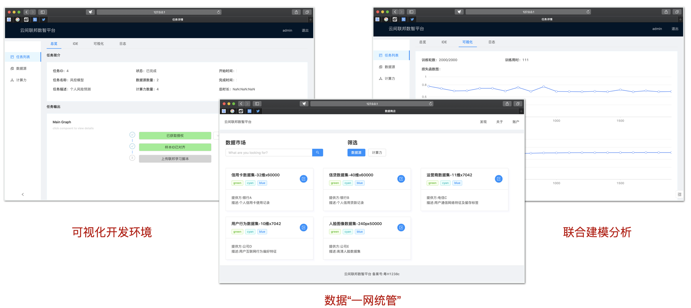
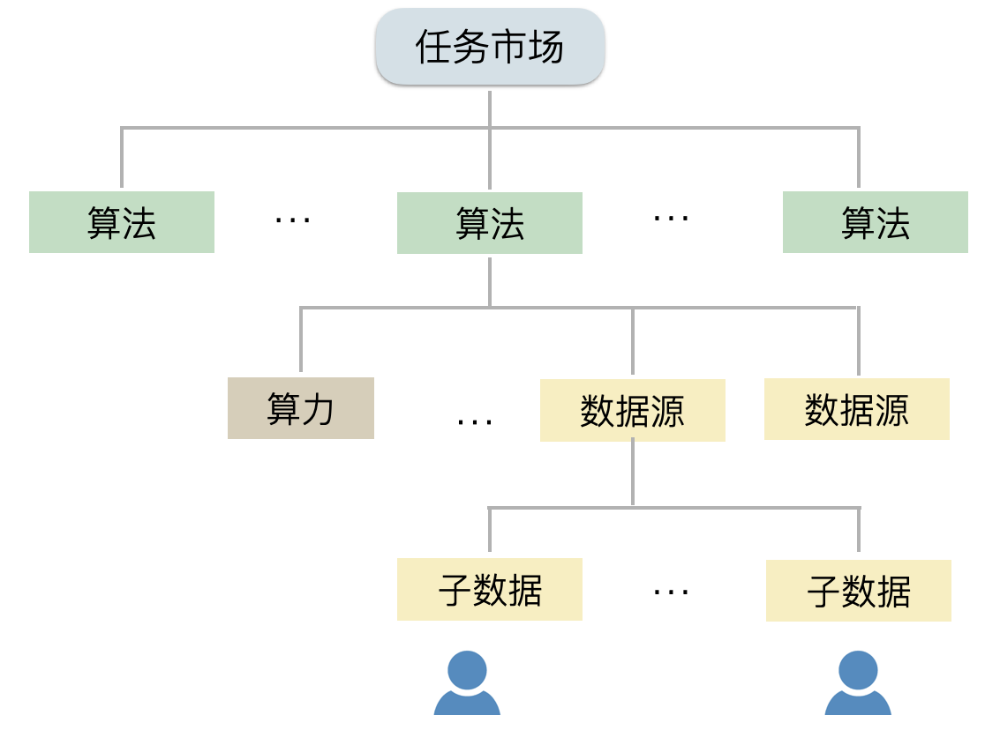

# 区块链数智协作平台助力北外滩建设

## 项目介绍

数据是新基建的核心要素，数据融合共享将持续带来诸多的创新用例。在IOT、5G等技术背景下，连接全域数据并实现数据资源的“一网统管”是当前企业间、部门间亟需创新改进的领域。然而，在目前的监管合规要求下，企业出于用户数据的隐私考虑或是商业利益考虑，通常不愿意将数据资产对外开放共享。

本项目旨在利用隐私计算和区块链等技术，在保证企业数据不出私域的情况下，实现数据的安全融合计算。项目定位为应用层中间件，构建开放数据集市场，并提供对业务人员、数据科学家友好易用的多方数据协作软件。底层使用了Ocean、Platon(rosetta)、TF(encrpyted)等基础协议。同时，我们设计了两个方案，即共享特征学习和可组合数据通证，来确保联合模型训练的可扩展性，并对远程计算进行分布式权限管理。

以下是我们的产品原型界面，场景为利用两个银行的用户信贷数据源来进行联合风险评估。

<div align="center">
 
</div>

## 共享特征学习

常见的隐私AI训练框架将模型和数据进行同态加密或安全多方计算处理，在密文状态下进行计算。然而，这种方案不能确保模型训练的可扩展性，如无法将数据源方扩大到N方、需要大量的带宽通信或交互次数。实际上，模型的第一层特征Z跟数据源的关联性最强，如果能找到一种方式，让Z不泄漏数据源的任何信息，我们就能在特征Z的基础上添加复杂的神经网络模型，从而利用经典的AI框架来确保训练效率。结合纵向联邦学习场景，我们设计出了以下的共享特征学习方案，[代码仓库](https://github.com/ownership-labs/rosetta-tutorials)：

<div align="center">
 
</div>

简单来说，让每个数据源方在本地维护一个特征变化矩阵W_i，得到本地特征Z_i后进行秘密共享SS。安全计算节点负责在N个数据源Z_i的碎片上进行聚合，只需要通过mpc.add(...)来得到Z。数据应用方/模型任务发起方可以在聚合特征Z的基础上添加任意的网络结构。在这个方案下，在不知道W的情况下，是无法根据Z反推出任一x的。

## 可组合数据通证

当前业务部门间、机构间相互隔离，除了利用隐私计算实现原始数据不出私域外，各主体还需要满足监管的合规要求。因此，还需要设计远程计算的权限管理方案，保证对私域数据的操作都是可审计追踪的。GDPR等法规下，用户也应具备数据使用的知情权。万亿美元数据市场下，如何精准追踪数据使用的全流程以定价就是一个关键问题。

针对这个问题，我们设计出了可组合数据通证(Composable Data Token，CDT)，[代码仓库](https://github.com/ownership-labs/cdt-sdk)。数据、算力、算法等资产都可以用CDT来进行唯一标识，不同资产具有不同的元信息(metadata)。我们使用链上的CDT标识符来定位链下资产的文档对象DDO存储位置（ipfs地址)：

```
CDT标识符在链上注册为：{CDT, owner_address, storage_path, proof}
DDO元数据在链下存储为：{CDT，proof，metadata: {[child_cdts_list], type, endpoint, extra_params}}
```

其中proof=hash(metadata)，每个DDO里可以包含多个子CDT，type区分数据、算力、算法，endpoint为服务地址。算法DDO中还包含对各资源的操作代码哈希(工作流存证)。联合计算的问题结构通常是这种嵌套形式，以下图为例：

<div align="center">
 
</div>

一个数据源可由多个子数据源构成，一个远程算法应用在多个数据源和算力上，一个联合任务通常也可包含多个算法阶段。在这种情况下，高层的算法CDT在执行实际计算时，需要获取低层资源的使用授权，而低层CDT通常会验证算法操作是否符合自己的使用条款，满足即在链上授权。值得一提的是，授权不意味着可以发起远程计算，否则无法追踪数据和算力使用。我们设计了一个链上的任务市场，作为算法CDT的终止状态，当一"可信"机构将该CDT存证到任务中后，意味着有人为该远程计算担保。数据源方也可以获知本地数据将如何被使用、以及被谁使用。

本次比赛，我们还思考了CDT在Qtum Special Topic上的运用。基于CDT提供的复杂资源的可信使用记录，市场的价格发现机制会最终确定出较为准确的资源的度量衡，具体分析见[链接](./qtum.md)。
