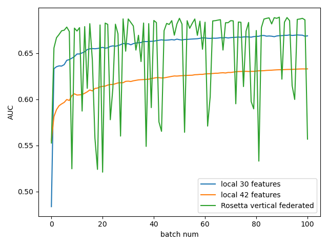

## Rosetta进行纵向联邦建模

本仓库封装了Rosetta进行逻辑回归的代码。

首先需要创建配置文件，在Python脚本的工作目录下。

配置文件如下：

```json
{
  "PARTY_ID": 0,
  "PSI": {
    "HOST": "127.0.0.1",
    "PORT": 8910,
    "RECV_PARTY": 2
  },
  "MPC": {
    "FLOAT_PRECISION": 16,
    "P0": {
      "NAME": "PartyA(P0)",
      "HOST": "127.0.0.1",
      "PORT": 8911
    },
    "P1": {
      "NAME": "PartyB(P1)",
      "HOST": "127.0.0.1",
      "PORT": 8912
    },
    "P2": {
      "NAME": "PartyC(P2)",
      "HOST": "127.0.0.1",
      "PORT": 8913
    },
    "SAVER_MODE": 7,
    "SERVER_CERT": "../certs/server-nopass.cert",
    "SERVER_PRIKEY": "../certs/server-prikey",
    "SERVER_PRIKEY_PASSWORD": "123456"
  }
}
```

`P0`，`P1`，`P2` 三项表示三个联邦学习参与方的地址。`SERVER_CERT/SERVER_PRIVKEY` 是通讯的公钥，在**测试**中可以直接使用[官方教程中的文件](https://github.com/LatticeX-Foundation/Rosetta/tree/master/example/tutorials/code/certs) 。

具体代码执行脚本如下：

1. 定义数据源。包括特征文件和标签文件。其中的标签文件只能是一维的。即`n × 1` 的形状。

   ```python
   from RosettaCli.Models.Logistic import LogisticRegression
   logistic = LogisticRegression(72, 1) # 逻辑回归，72维特征，1维标签
   # The files in different parties.
   # In this example, party 0 and 1 have the feature file
   # And party 2 have the label file
   feature_files = {
       0: "../Data/credit_default0-30.csv",
       1: "../Data/credit_default30-72.csv",
   }
   label_files = {
       2: "../Data/credit_default73.csv"
   }
   logistic.set_dataset(feature_files, label_files, 40000) # 40000表示前40000条用于训练，之后的用于测试
   ```

2. 开始训练

   ```python
   party = rtt.py_protocol_handler.get_party_id()
   aucs = []
   for i in range(10001):
       if i % 100 == 0:
           if party == 0:
               pred_y, true_y = logistic.test_one_batch()
               auc = roc_auc_score(true_y, pred_y)
               # 注意只有party0才能获取信息
               print("AUC at round %d: %.4f" % (i, auc))
               aucs.append(auc)
           else:
               logistic.test_one_batch()
       logistic.train_one_batch()
   
   np.savetxt("rosetta72.csv", np.array(aucs).reshape([-1, 1]))
   ```

### 实验结果



Rosetta训练存在不稳定性，但对比本地单方特征，双方联合建模的AUC比单方最高值提高了3%左右。
